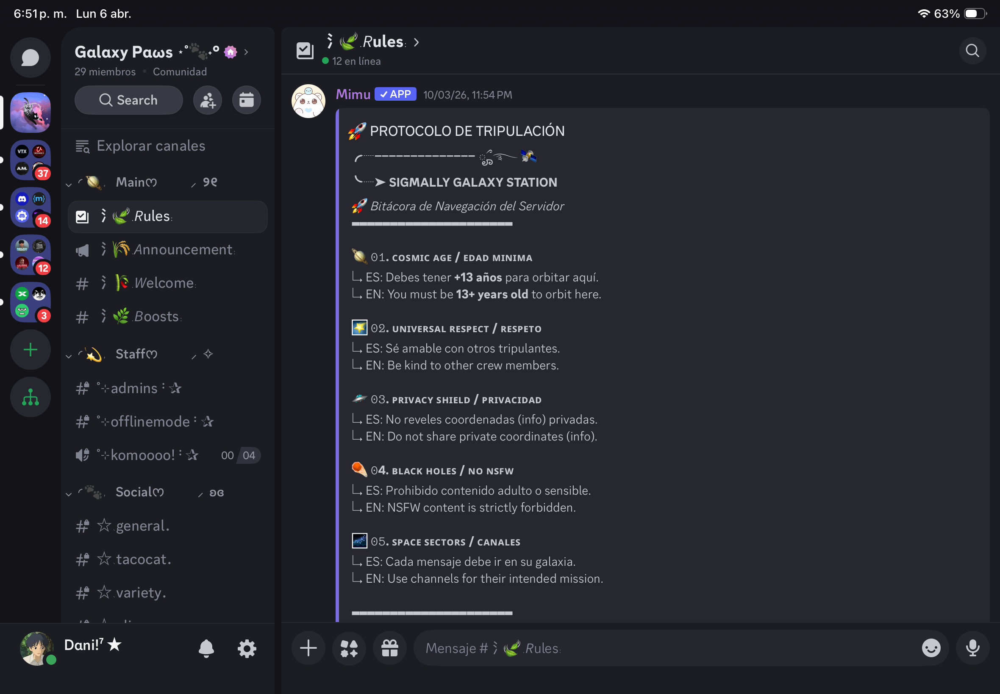

<p align="center">
  
</p>

---
<p align="center">
  
</p>

[](https://discord.gg/SQasBExHsK)
[![Build Status][build]][build-url]
[![Coverage Status][coverage]][coverage-url]
[![Version][version]][version-url]

Galaxy Paws es una comunidad de jugares de [sigmally](https:\\www.google.com), también es un clan, pero principalmente la consideramos un grupo de amigos para pasarla bien y divertirse. usando tanto canales de texto como de voz. Este cuenta con xxxx miembros hasta la fecha : `(6/04/2026)`

En estos días estábamos considerando la idea de activar nuevamente la comunidad, y así será, para ello traemos la nueva actualización del server que nos diferenciará del resto. Será una comunidad única e increíble.

Para dar cuenta de los cambios en el server, se adjunta a continuación documentación de cómo va el server hasta ahora, con funciones y aspectos estáticos, poca organización y demás. Posteriormente se presentarán las novedades, correcciones y cambios que tendrán esta nueva actualización.
<p align="center">
  
  <br>
  <em><b>Server de Discord de Galaxy Paws 06/04/2026</b></em>
</p>

- **Guía para desarrolladores:** Si deseas obtener mayor información de como crear un Changelog eficaz para `Cmnty-Sig` puedes ver la documentación en nuestra [página web](https://www.google.com)
- **Guia para miembros** : Te recomendamos ver los cambios de cada actualización más claramente en nuestro [servidor de Discord](https://www.googlw.com), pero si deseas también puedes verlo en esta página. Para descargar este documento puedes hacer [click aquí](https://www.google.com)

> [!IMPORTANT] 
> Para saber cómo crear los diseños de banners para los embeds de una comunidad puedes ver la documentación [aquí](https://www.google.com) o directamente ir a nuestra [carpeta especial](https://www.google.com) en las que hay plantillas y ejemplos de marca totalmente gratis

---

## Novedades del server!
La nueva actualización trae nuevas funciones, nuevos comandos, y un nuevo toque que mejora la experiencia de los miembros y permite una mejor administración de la comunidad.
> Asimismo también trae una nueva característica que involucra la vinculación e integración con [BotGhost](https://www.google.com). Un Dashboard moderno que permite la creación y administración de bots personalizados. 

| Type change | Description |
|:-----|:------------|
| `comando` | <kbd>/profile</kbd> Sistema de perfiles (monedas, nombre, estadísticas) |
| `comando` | <kbd>/team</kbd> Búsqueda de team para partidas diarias y torneos (ping al rol `@team`) |
| `sistema` | **Achievements & badges** (`new ppl`, `epic`, `legendary`, `mitic`, `master`) |
| `sistema` | Sistema de soporte con menú de navegación + reglas en `#support-guidelines` |
| `auto` | Sistema anti-inactividad, rol especial + ping a las 2 semanas |
| `auto` | Bienvenida automática por `DM` con enlaces e invitación a compartir el server |
| `evento` | **Torneos (con reglas) y eventos únicos** para toda la comunidad de Sigmally |
| `evento` | Eventos tipo "Mejor jugada del año" con recompensas por contenido viral |
| `canal` | Espacio para creadores: `#clips-gameplay` + `#rate-clips` |
| `recurso` | Sección de recursos (`skins`, `macros`, etc.) también en la página web |
| `especial` | Página de guía y documentación útil para jugadores de Sigmally |
| `mensaje` | FAQ del server y del juego (también en la página web) |
| `new bot` | Integración con Wikipedia (`wiki-bot`) |
| `sistema` | Sistema musical mejorado (embeds con info adicional, recomendaciones, etc.) |
| `privado` | Canales y utilidades exclusivas para miembros del clan |
| `embed` | **Server Discord Navigation** (lista de canales e info adicional) |
| `especial` | Contenidos del server en repositorio de GitHub (mejor administración) |
| `especial` | Nuevo mod de juego creado por **Dani!** (`<kbd>Dani Mod</kbd>` ) |
| `comando` | Más comandos útiles y de desarrollo |

> [!NOTE] 
> **Habran más novedades próximamente!** Estate atent@! Agradecemos el aporte que hacen los miembros con cada una de sus ideas y/o sugerencias. Si quieres apoyarnos en esto puedes hacerlo por nuestro canal de [#suggestions](https://www.google.com).

---

## Experiencia y mejoras

- `[rules]` Cambios en las reglas de la comunidad
- `[welcome]` Cambios en el canal de bienvenidas y despedidas (apariencia de mensajes, etc.)
- `[boosters]` Nueva política en los boosts del servidor (beneficios de boosters, etc.)
- `[moderation]` Integrar sistema de mods de prueba (`trial mods`)
- `[ui]` Mejora en la apariencia (paleta de colores) de embeds y mensajes
- `[structure]` Reestructuración total del servidor
- `[roles]` Más roles públicos, únicos y según nivel de actividad o apoyo al server
- `[music]` Mejora en la experiencia musical (embeds con info adicional, recomendaciones, etc.)
- `[interaction]` Mejora en la interacción general

---

## Estabilidad y correcciones

- `[automod]` Reconfigurar auto-mod, mejorar la seguridad
- `[security]` Mejora de seguridad global
- `[legacy]` Corrección de estructura legacy
- `[ux]` Optimización de experiencia del usuario

---

## Ecosistema de bots

| Tipo de bot | Purpose |
|:----|:--------|
| `security-bot` | Seguridad |
| `utility-bot` | Utilidad |
| `entertainment-bot` | Entretenimiento |
| `custom-bot` | Bot personalizado del servidor |
| `stats-bot` | <kbd>ServerStats</kbd> (estadísticas en tiempo real) |
| `wiki-bot` | Integración informativa (Wikipedia) |

---

## Estructura del server

### ‼️ Nuevos canales

- <kbd>[ [text](https://www.google.com) ]</kbd> + <kbd>[ [announce](https://www.google.com) ]</kbd> + <kbd>[ [forums](https://www.google.com) ]</kbd> + <kbd>[ [voice](https://www.google.com) ]</kbd> + <kbd>[ [stage](https://www.google.com) ]</kbd>  🏁 Expansión completa
- `[public]` / `[private]` ⚑ Separación de canales públicos y privados
- `[nav]` ⚑ Navegación optimizada

  
### Canales de texto

> ⚠️ Los canales de texto que se muestran a continuación se crearán en diferentes [categorias](https://www.google.com) del servidor, y algunos de estos serán privados o se abrirán únicamente en [fechas especiales](https://www.google.com).

`#tickets` \ `#updates` \ `#staff-team` \ `#readme` \ `#rate-clips` \ `#clips-gameplay` \ 🔒 `#moderators` \ 🔒 `#apps-testing` \ 🔒 `#roadmap-server` \ 🔒 `#changelogs` \ `#team-up` \ 🔒 `#tag-glpaws` \ 🔒 `#chat-galaxy` \ `#members-glpaws` \ 🔒 `#multimedia` \ `#cmds` \ `#room67` \ `#tournament-reminders` \ `#bracket-update` \ 🔒 `#chat-trmt` \ `#ask-for-help` \ `#off-topic` \ `#bug-reports`

### Canales de anuncios

> ⚠️ Los canales de texto que se muestran a continuación se crearán en diferentes [categorias](https://www.google.com) del servidor, y algunos de estos serán privados o se abrirán únicamente en [fechas especiales](https://www.google.com).

`#annc-general` \ `#annc-tournaments` \ `#activity-check` \ `#feedback-ideas`

### Canales tipo foro 

> ⚠️ Los canales de texto que se muestran a continuación se crearán en diferentes [categorias](https://www.google.com) del servidor, y algunos de estos serán privados o se abrirán únicamente en [fechas especiales](https://www.google.com).

`#clubs-forum` \ `#discussions` \ `#articles` \ `#events` \ 🔒 `#suggestions`

### Canales de voz

> ⚠️ Los canales de texto que se muestran a continuación se crearán en diferentes [categorias](https://www.google.com) del servidor, y algunos de estos serán privados o se abrirán únicamente en [fechas especiales](https://www.google.com).

`#hangout01` \ `#hangout02` \ `#hangout03` \ `#voice-chat` \ `#music` \ 🔒 `#room-staff`

### Canales tipo escenario

> ⚠️ Los canales de texto que se muestran a continuación se crearán en diferentes [categorias](https://www.google.com) del servidor, y algunos de estos serán privados o se abrirán únicamente en [fechas especiales](https://www.google.com).

`#tournaments` \ `#galaxy`


---

### Resumen de actualización 2.0 ⬎

```yaml
Features: 18
Changes:  9
Fixes:    4
Bots:     6
Channels: 40+
```

> [!WARNING] 
> **Recuerda que esta documentación está abierta a cambios permanentes.** Si tienes dudas o estás interesado en este repositorio puedes contactarte con el desarrollador o con el equipo de soporte de nuestra comunidad.

<!-- conventional-changelog -->
[build]: https://img.shields.io/badge/build-passing-brightgreen
[build-url]: #
[coverage]: https://img.shields.io/badge/coverage-100%25-brightgreen
[coverage-url]: #
[version]: https://img.shields.io/badge/version-2.0.0-blue
[version-url]: #